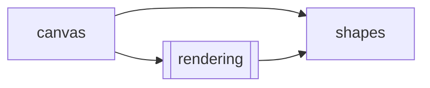
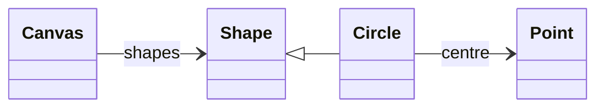

# drawn_package

Written by hand.

<!-- diagram: imports -->

```mermaid
flowchart LR
    canvas["canvas"]
    rendering[["rendering"]]
    shapes["shapes"]
    canvas --> rendering
    canvas --> shapes
    rendering --> shapes
```
<!-- end of diagram: imports -->

Also written by hand.

<!-- diagram: classes -->

```mermaid
classDiagram
    direction LR
    class Canvas
    class Point
    class Shape
    class Circle
    Shape <|-- Circle
    Canvas --> Shape : shapes
    Circle --> Point : centre
```
<!-- end of diagram: classes -->
